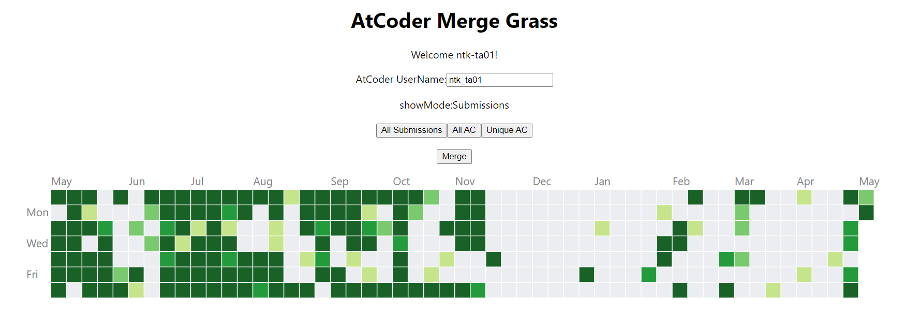
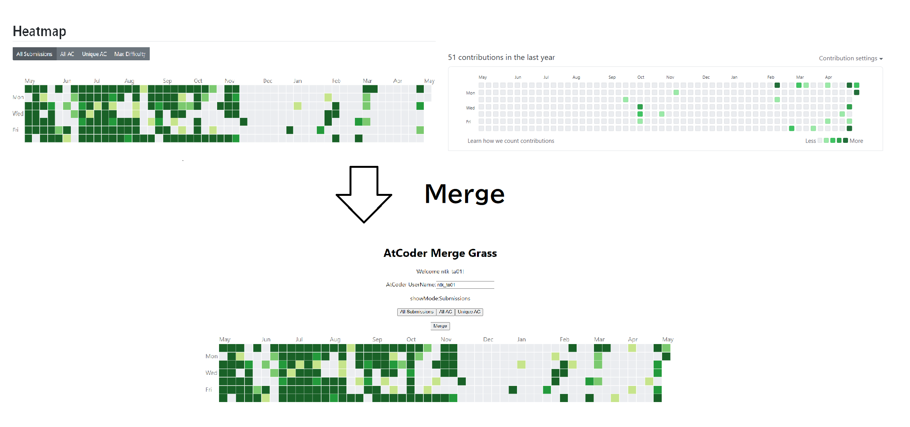

# AtCoder Merge Grass

AtCoder ProblemsとGitHubの芝をマージします。

## 使い方

GitHubのログインと、AtCoderのアカウント名の入力が必要です。入力ができたらMergeボタンを押すとマージ後の芝が生成されます。

## 実装したいが困難

- GitHubのREADMEにコピペすれば表示されるカードを作りたい
- 画像付きでツイートできるボタンを作る（画像を付けるのが大変そう）

## Todo

- エラー処理をもう少しどうにかする